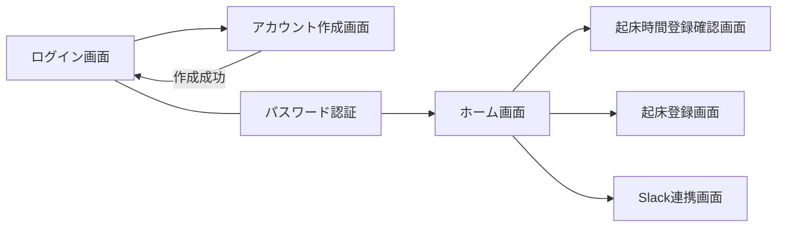

# lawitter

## Docker立ち上げ~開発まで

### 手順

1. `make up`
1. VSCodeのDockerメニューから開発したいサーバー（バックエンドなら**backend**）を右クリック
1. **Attach Visual Studio Code**をクリック
1. **フォルダーを開く**
1. `/src`を開く

### 注意事項

- `make`コマンドは、`docker compose`コマンドを楽に使えるようにしたもの
  - 詳しくは[`Makefile`](./Makefile)を参照
- 仮想環境の`src`と、ローカルPCの[`backend/src`](./backend/src/)は同期されている
- `pip install`などでパッケージを追加した場合は、閉じる前に`pip freeze > requirements.txt`を実行する
  - そうしないと次実行したときにまたインストールを手動でやる羽目になる

## API仕様

### 新規登録
#### エンドポイント
`/v1/starwindow/create` (POST)

#### リクエスト

```json
{
    "name": "ユーザーの名前",
    "password":"暗号化したパスワード",
}
```

#### レスポンス

```json
{
    "status": "TrueかFalseが返ります",
    "details":"Falseだった時の詳細メッセージ",

}
```

### ログイン画面
#### エンドポイント

`/v1/startwindow/login` (POST)
#### リクエスト

```json
{
    "name": "ユーザーの名前",
    "password":"暗号化したパスワード",
}
```

#### レスポンス

```json
{
    "status": "return True or False",
    "details": "Falseだった時の詳細メッセージ",
    "jwt-key": "jwtkey",
    "refresh-key": "refkey",
}
```

### 時間、メッセージ設定
#### エンドポイント

`/v1/configwindow/set_time` (POST)
#### リクエスト

```json
{
    "wake_time": "起床時間",
    "late_text": "遅刻した際の送信文",
}
```

#### レスポンス

```json
{
    "status": "return True or False",
    "details": "Falseだった時の詳細メッセージ",

}
```

### 時間確認
#### エンドポイント

`/v1/configwindow/req_time` (GET)

レスポンス
```json
{
    "status": "True",
    "wake_time": "起床時間",
    "late_text": "遅刻した際の送信文",
}
```


### Slackワークスペース設定
#### エンドポイント

`/v1/configwindow/set_slack` (POST)

```json
{
    ""
}
```

### 起床確認
#### エンドポイント
`/v1/activate` (POST)

#### リクエスト

```json
{
    "wakeup": "True",
}
```

#### レスポンス

```json
{
    "status": "True",
}
```


### cronからのリクエスト

#### リクエスト


```json
{
    "status": "True",
}

```

#### レスポンス

```json
{
    "status": "return True or False" 
}
```

## フロントエンド画面構成

### ログイン画面

- ID
- パスワード
- ログインボタン

### アカウント作成画面

- ID
- パスワード
- パスワード確認
- サインアップボタン

### ホーム画面

- 起床時間登録・確認画面へのリンク
- Slack連携画面へのリンク

ログインしていない場合は、ログイン画面へのリンクを表示する。

### 起床時間登録・確認画面

- 起床時間入力欄
- 登録ボタン

起床時間が登録されている場合は、登録されている時間と編集ボタンを表示する。  
登録されていない場合は、入力欄を表示する。  

### 起床登録画面

- 起床ボタン

### Slack連携画面

- トークン入力欄
- チャンネル名入力欄
- 登録ボタン

トークンが登録されている場合は、登録されている旨のメッセージと編集ボタンを表示する。  
登録されていない場合は、入力欄を表示する。


